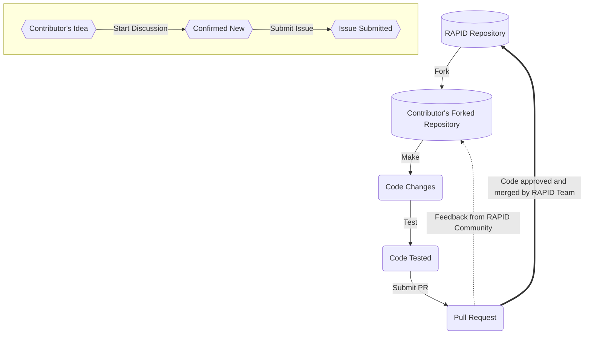

# Contributing Guide

Thank you for taking the time to consider contributing! We very much appreciate
your interest. This document outlines the many ways you can contribute to our
project, and provides detailed guidance on best practices. We look forward to
your help!

## Prerequisites

Before you begin contributing to our project, it is be a good idea to ensure
you've satisfied the pre-requisites outlined below.

### License

Our project has licensing terms, including rules governing redistribution;
documented in our [`LICENSE`][URL_LICENS] file. Please take a look at this file
and ensure you understand the terms. This will impact how we, or others, use
your contributions.

### Code of Conduct

Our Code of Conduct helps facilitate a positive interaction environment for
everyone involved with the team, and provides guidance on what to do if you
experience problematic behavior. Read more in our
[`CODE_OF_CONDUCT.md`][URL_CONDUC], and make sure you agree to its terms.

### Code of Scientific Collaboration

Our Code of Scientific Collaboration ensures a shared commitment to advancing
scientific knowledge together to achieve meaningful impact while supporting the
sustainability of scientific research. Read more in our
[`CODE_OF_COLLAB.md`][URL_COLLAB], and make sure you follow to its terms.

### Communication Channels

Before contributing changes to our project, it is a good idea to be familiar
with our communication channels and to socialize your potential contributions
to get feedback early. This will help give you context for your contributions,
no matter their form.

Our communication channels are:

- [Issue tracking system][URL_ISSUES]: a regularly monitored area to report
   issues with our software or propose changes
- [Discussion board][URL_DISCUS]: a permanently archived place to hold
   conversations related to our project. This resource can be searched for old
   discussions.

### Contribution Expectations
 
We are deeply grateful for all contributions, big or small. Please note that
while we do our best to engage, we may not always have time to support every
contribution. To keep the repository maintainable, we kindly ask that you start
a discussion or issue before submitting a pull request. Submissions made
without prior engagement are welcome but may be declined or ignored at our
discretion.

## Our Development Process

Our project is designed to facilitate contributions, and the following visual
describes the process by which your contributions may be integrated.

<!-- pyml disable-num-lines 20 line-length-->
[URL_LICENS]: https://github.com/c-h-david/rapid2/blob/main/LICENSE
[URL_CONDUC]: https://github.com/c-h-david/rapid2/blob/main/CODE_OF_CONDUCT.md
[URL_COLLAB]: https://github.com/c-h-david/rapid2/blob/main/CODE_OF_COLLAB.md
[URL_ISSUES]: https://github.com/c-h-david/rapid2/issues
[URL_DISCUS]: https://github.com/c-h-david/rapid2/discussions
